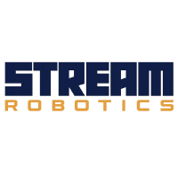

<header class="stream-header">
  

    

      
      <h1>STREAM Robotics Lab</h1>
    

    <nav class="main-nav">
      <a href="#papers">Papers</a>
      <a href="#robots">Robots</a>
      <a href="#contributing">Contributing</a>
    </nav>
  

</header>

**Welcome!**

The **AeroSpace AuTonomous Robots with Onboard IntElligent AlgorithMs team (STREAM Robotics Lab)** is part of the Department of Mechanical and Aerospace Engineering at Politecnico di Torino and of the Flight Mechanics Research Team.

Our team is involved on researchs related to Unmanned Aerial Vehicles, Ground Robots and Space systems. The main research topics are real-time guidance and control algorithms for advanced autonomous vehicles and robots, Guidance, Navigation and Control (GNC) algorithms for space proximity operations, design of robust and variable structure controllers for autonomous systems.

<h2 id="papers">Our Projects</h2>

- **RoboticsXR**: RoboticsXR is an extended reality framework that fuses real-world robot motion with synthetic visual data. It uses ROS2 to integrate a YOLOv8-based detection system and a ResNet50 network for precise distance estimation, enabling efficient testing of visual navigation algorithms across varied hardware and lighting conditions. [Read more](papers/robotics-xr.md).

<h2 id="robots">Our Robots</h2>

The Robots (UGVs and UAVs) employed in our research activities are listed below and their descriptions is found in the `robots` folder.

### UGVs (Unmanned Ground Vehicles)

| Robot Name | Image |
|------------|-------|
| Devastator |  |
| Lynx |  |
| Turtlebot4 |  |

### UAVs (Unmanned Aerial Vehicles)

| Robot Name | Image |
|------------|-------|
| Mavtech RX2 |  |

<h3 id="contributing">Contributing</h3>

Please check out our [Best Practice Guide](https://github.com/STREAMRobotics/.github/blob/main/profile/CONTRIBUTING.md) on GitHub for naming conventions and commit guidelines.
